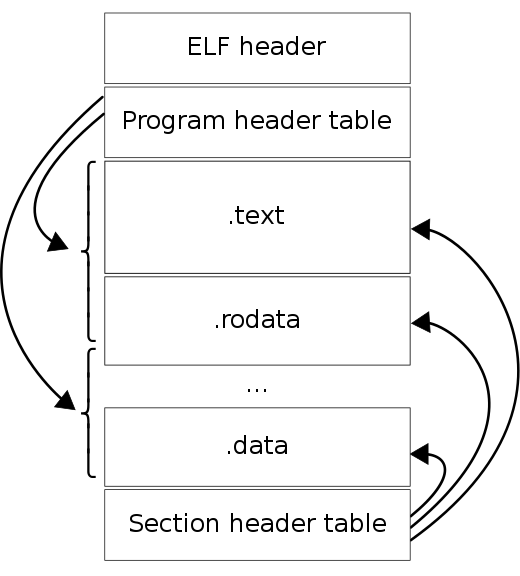

# ELF 檔案格式
```
ELF == Executable and Linkable Format ==可執行與可鏈結格式 

是一種適用於linux/unix 的
執行檔(executable files) 的標準檔案格式 <== 先從這裡開始學
目的檔(object code)  的標準檔案格式 <== 以後再學(也可以上網找資料當作業寫)
共享函數庫(shared libraries) 的標準檔案格式 <== 以後再學(也可以上網找資料當作業寫)
核心轉儲(core dump) 的標準檔案格式 <== 以後再學(也可以上網找資料當作業寫)
```
```
wiki ==>可參考資料較少的中文版
https://en.wikipedia.org/wiki/Executable_and_Linkable_Format
```
# ELF 檔案架構(wiki資料)[]



```
ELF檔案的組成：ELF header

程式檔頭(Programm Header)：描述段資訊
Section檔頭(Section Header)：連結與重定位需要的資料

程式檔頭(Programm Header)與Section檔頭(Section Header)需要的資料 .text .data
```
# 工具
```
readelf  <==本次課程示範使用
```
```
objdump <==  上網找資料 寫作業
```
```
nm  ==> nm被用來檢查二進位檔案（包括庫，編譯後的目標模組，共享目的檔，和獨立可執行檔）
        並顯示這些檔案的內容，或儲存在其中的元資訊，特別是符號表(Symbol table) 
        
        至於符號表(Symbol table)  嗎?? 可以以後再學
        或 參考 https://en.wikipedia.org/wiki/Symbol_table
        
    <== 根據底下wiki文件與範例程式完成練習  
        https://zh.wikipedia.org/wiki/Nm_(Unix)
```
